## 目的

この授業では、Rでデータを読み込み、集計や分析を行います。Rとは、統計計算や作図のためのプログラミング言語です。Positronは、Rのコードを書き、実行結果や図を確認するためのアプリです。パソコンに両方をインストールして使います。

このページでは、成人1,000人の架空の調査データを使い、年齢の集計と作図まで試します。最後に、保存したコードを開き直して、同じ結果を出せることを確認しましょう。ブラウザでこのページを開き、Positronと並べると、コードをコピーしながら進められます。

## RとPositronの導入

使っているOSのタブを開き、R、Positronの順に導入してください。**既にRを使っている人も、下の手順で最新版に更新してください。**

::: {.panel-tabset}

### Windows

1. 「設定」→「システム」→「バージョン情報」で、Windowsのバージョンと「システムの種類」を確認します。以下はWindows 10以降のx64のパソコンを前提にしています。ARMベースと表示される場合は、使用するRとパッケージの対応を教員と確認してください。
2. [RのWindows用ダウンロードページ](https://cran.r-project.org/bin/windows/base/)を開き、先頭の「Download R-… for Windows」からインストーラー（`.exe`）を保存します。保存したファイルを開き、画面に従ってインストールします。インストール先などは通常、初期設定のままで構いません。
3. [Positronのダウンロードページ](https://positron.posit.co/download.html)を開き、Windowsのx64用「User install」を保存して、インストールします。公式ページの「Windows setup」に案内されているVisual C++ Redistributableも確認し、未導入ならリンク先のx64用をインストールしてください。
4. スタートメニューからPositronを起動します。既にPositronを開いていた場合は、作業を保存してから終了し、起動し直します。

Rの更新では、以前のRが残る場合があります。後の手順で、Positronが新しいRを使っていることを確認します。

### macOS

1. Appleメニューの「このMacについて」で、macOSのバージョンと「チップ」または「プロセッサ」を確認します。Apple MシリーズならApple Silicon（arm64）、IntelならIntel（x86_64、x64）の配布物を選びます。
2. [RのmacOS用ダウンロードページ](https://cran.r-project.org/bin/macosx/)を開き、「Latest release」の自分のチップに合うインストーラー（`.pkg`）を保存します。R 4.6.1では、Apple Silicon用はmacOS 14以降、Intel用はmacOS 11以降が必要です。条件を満たさない場合は、作業を進める前に教員に相談してください。
3. 保存した`.pkg`を開き、画面に従ってインストールします。ダウンロードフォルダへのアクセスを求められた場合は許可します。
4. [Positronのダウンロードページ](https://positron.posit.co/download.html)から、同じチップに合うmacOS用ファイル（`.dmg`）を保存します。開いた画面でPositronをApplications（アプリケーション）フォルダへドラッグします。
5. アプリケーションフォルダからPositronを起動します。既に開いていた場合は、作業を保存してから終了し、起動し直します。

RとPositronにはそれぞれ対応OSがあります。Positronを起動できても、上のRの条件を満たすか確認してください。

:::

## 作業フォルダの作成 {#folder-script}

以下の図は、macOS版Positron 2026.09.1の画面をもとに操作説明を加えた参考イメージです。クリックすると拡大できます。実行するコードは、本文のコード枠からコピーしてください。

データとコードを同じ場所に保存するために、授業用フォルダを作ります。

1. エクスプローラー（Windows）またはFinder（macOS）で、保存場所を決め、`data-analysis` というフォルダを作ってください。
2. Positronの「File」→「Open Folder…」で、そのフォルダを開きます。作成したフォルダを信頼するか尋ねられたら、フォルダ名を確認して信頼する選択肢を選びます。

PositronのExplorer（ファイル一覧）に、開いたフォルダの名前が表示されていることを確認しましょう。まだファイルを作っていないので、一覧が空でも構いません。

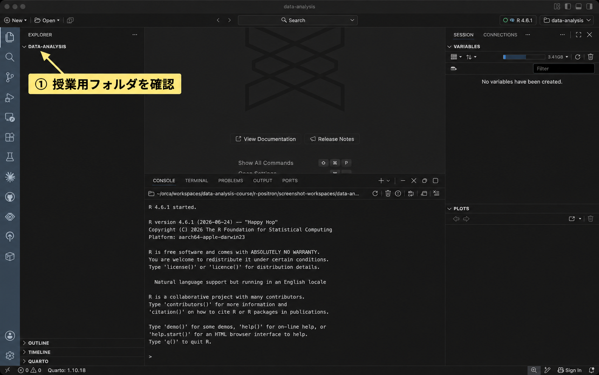{fig-alt="左側のExplorerにあるDATA-ANALYSISのフォルダ名を矢印で示している。" loading="lazy"}

## 画面の見方

Positronでは、次の領域を使います。配置を変更している場合は、位置よりタブの名前を手がかりにしてください。

| 領域 | このページで行うこと |
|---|---|
| Explorer（ファイル一覧） | 授業用フォルダのCSVやRスクリプトを開く |
| Editor（スクリプトの編集領域） | `setup-check.R` にコードを書いて保存する |
| Console（コンソール） | Rに指示を入力し、実行したコードの結果やエラーを読む |
| Variables | Rに読み込んだデータや、名前を付けた計算結果を確認する |
| Plots | Rで作った図を見る |

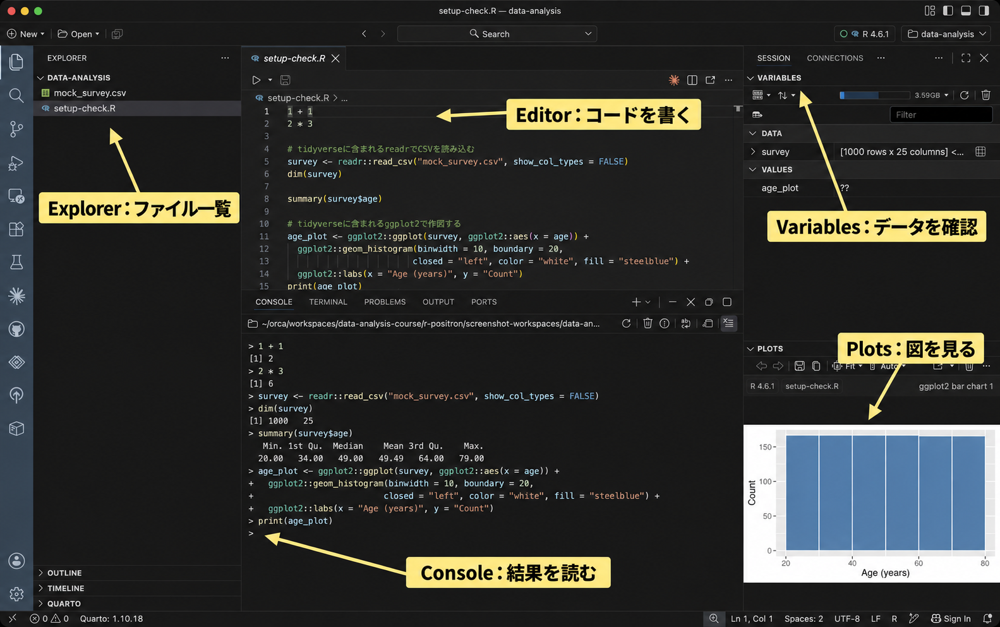{fig-alt="Explorer、Editor、Console、Variables、Plotsの位置と役割を黄色のラベルで示している。" loading="lazy"}

## Rの動かし方

Rに計算などを指示する文を、コードと呼びます。まずConsoleに直接コードを入力して実行し、次にスクリプトに書いたコードを実行してみましょう。

### 使用するRの選択

Positronの画面右上にある「Start Session」またはRのバージョン表示をクリックします。これは、コードを実行する言語とバージョンを選ぶ場所です。既に実行中のRがある場合は「New Console Session…」を選ぶと、インストール済みの言語の一覧を開けます。インストールした新しいRを選び、ConsoleにRの起動メッセージと入力待ちの `>` が出るまで待ちます。Rが一覧に出ない場合は、[Rが見つからない場合](#r-not-found)を確認してください。

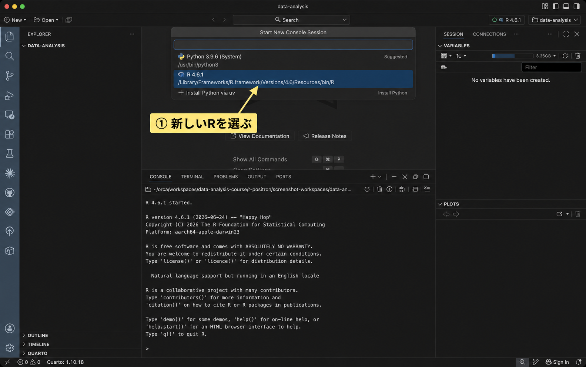{fig-alt="Start New Console Sessionの一覧でR 4.6.1を選ぶ位置を矢印で示している。" loading="lazy"}

### Consoleに入力して実行する

Consoleでは、コードを入力してEnterを押すと、Rがそのコードを実行します。まず、足し算を試します。

1. PositronのConsoleを見て、一番下にある `>` を探してください。これは、Rが次の指示を待っている印です。
2. `>` の右側をクリックし、半角で `1 + 1` と入力します。`>` 自体は入力しません。
3. Enterを押してください。Consoleに `[1] 2` と表示されれば、計算できています。先頭の `[1]` は表示する値の位置を表すもので、答えは `2` です。
4. 結果の下に、新しい `>` が表示されます。次のコードは、この新しい `>` の右側に入力します。

続いて、Rのバージョンを調べます。次のコードは手入力するほか、教材からコピーして使うこともできます。

```{r}
#| label: setup-r-version
R.version.string
```

1. 上の枠内の `R.version.string` を選択し、WindowsではCtrl+C、macOSではCommand+Cでコピーします。コード枠のコピーボタンも使えます。
2. PositronのConsoleに戻り、一番下の `>` の右側をクリックします。
3. WindowsではCtrl+V、macOSではCommand+Vで貼り付けます。入力欄に `R.version.string` が入ったことを確認し、Enterを押してください。
4. `R version 4.6.1 ...` のように表示されます。ダウンロードした版と一致していることを確認しましょう。

この後の手順で「Consoleで実行する」と書かれていたら、同じように入力欄へコードを貼り付け、Enterを押します。結果や説明文は貼り付けず、コードだけを使ってください。

{fig-alt="Consoleの入力待ちの位置とR.version.stringの実行結果を矢印で示している。" loading="lazy"}

### Rスクリプトを作成する

同じ計算を後でやり直せるように、ここからはコードをファイルに保存します。Rのコードを書いて保存するテキストファイルを、Rスクリプトと呼びます。ファイル名の末尾には `.R` を付けます。

1. Positronの「File」→「New Text File」を選びます。Editorに新しいファイルが開きます。
2. 「File」→「Save」を選び、保存先を先ほど作った `data-analysis` フォルダにします。
3. ファイル名を `setup-check.R` にして保存します。EditorのタブとExplorerのファイル一覧に、この名前が表示されることを確認してください。

この時点では、ファイルの中身は空です。次に、Editorへコードを書き込みます。

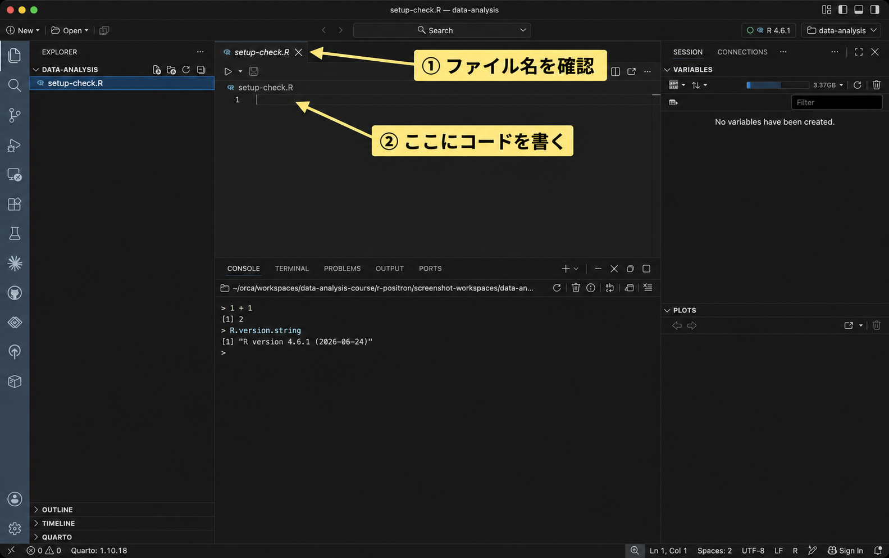{fig-alt="setup-check.Rのタブと空の編集領域を矢印で示している。" loading="lazy"}

### スクリプトに貼り付けて1行ずつ実行する

次の2行を、先ほど作った `setup-check.R` に貼り付けます。

```{r}
#| label: setup-first-code
1 + 1
2 * 3
```

1. 上のコード2行をコピーします。
2. Positronで `setup-check.R` のタブを開き、その下の白紙の編集領域をクリックします。
3. WindowsではCtrl+V、macOSではCommand+Vで貼り付けます。Editorに2行のコードが表示されていることを確認してください。

**スクリプトにコードを書いただけでは、計算は始まりません。** EditorでEnterを押すと改行が入ります。コードを実行するには、次の操作を使います。

1. Editorにある `1 + 1` の行をクリックし、その行にカーソルを置きます。文字を選択する必要はありません。
2. WindowsではCtrlを押しながらEnter、macOSではCommandを押しながらEnterを押します。
3. Consoleを見てください。Editorから送られたコードと、計算結果の `[1] 2` が表示されます。コードはEditorにも残っています。
4. 同じように、Editorの `2 * 3` の行をクリックし、Ctrl+EnterまたはCommand+Enterを押します。`*` は掛け算の記号です。Consoleに `[1] 6` と出れば成功です。

このように、スクリプトから実行するときは、**Editorでコードを指定し、Consoleで結果を読みます。**

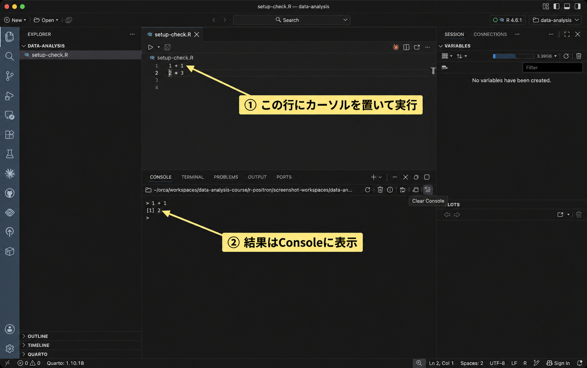{fig-alt="Editorの1 + 1の行とConsoleの計算結果2を矢印で示している。" loading="lazy"}

### 複数行をまとめて実行し、保存する

今度は2行をまとめて実行します。

1. Editorで `1 + 1` の先頭から `2 * 3` の末尾までドラッグし、2行とも選択します。選択した範囲の背景色が変わったことを確認してください。
2. 選択したまま、WindowsではCtrl+Enter、macOSではCommand+Enterを押します。
3. Consoleに2行のコードが上から順に送られ、結果の `2` と `6` が表示されます。
4. Editorをクリックし、WindowsではCtrl+S、macOSではCommand+Sを押して、スクリプトを保存します。

何も選択せずに実行するとカーソルのある式が、範囲を選択して実行するとその範囲のコードが実行されます。この後に出てくる、括弧などで複数行にまたがるコードは、教材のコード枠全体を貼り付け、ひとまとまりを選択して実行しましょう。

実行と保存は別の操作です。実行してもファイルへの保存は済んでいないことがあるため、コードを書き足したり直したりしたら、保存も行ってください。

| コードを入力する場所 | 実行する操作 | 結果を見る場所 |
|---|---|---|
| Consoleの `>` の右側 | Enter | Console（図はPlots） |
| EditorのRスクリプト | Ctrl+Enter（Windows）／Command+Enter（macOS） | Console（図はPlots） |

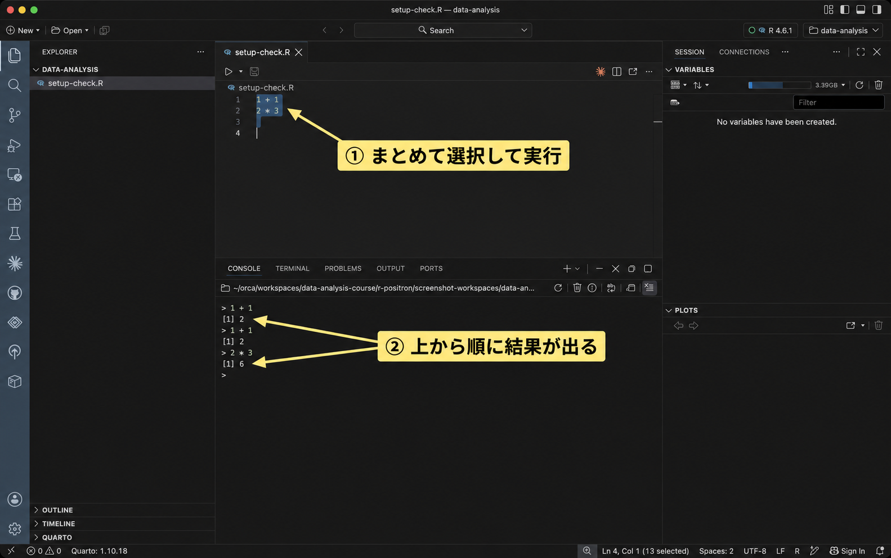{fig-alt="Editorで選択した計算2行と、Consoleに表示された結果2と6を示している。" loading="lazy"}

## パッケージの導入

パッケージとは、Rに機能を追加するものです。授業で使う次の4つを導入します。ここでは導入と確認だけを行い、個々の分析方法は各教材で説明します。

| パッケージ | 主な用途 |
|---|---|
| `tidyverse` | データの読み込み、加工、集計、作図 |
| `psych` | 心理尺度の記述や因子分析 |
| `lavaan` | 確認的因子分析や構造方程式モデリング |
| `marginaleffects` | モデルから予測値や効果を求める |

インターネットに接続した状態で、**次のコードをConsoleに貼り付けてEnterを押してください。** `install.packages()` はパッケージをダウンロードしてインストールする関数です。依存するパッケージも一緒に入るので、完了まで数分以上かかることがあります。再び入力待ちの `>` が出るまで待ちます。

```{r}
#| label: setup-install
# 授業で使うデータ処理、心理尺度、構造方程式モデル、予測の機能を導入する
install.packages(
  c("tidyverse", "psych", "lavaan", "marginaleffects"),
  repos = "https://cloud.r-project.org"
)
```

個人用ライブラリを作成するか聞かれた場合は、作成する選択肢を選んでください。このインストールは毎回の分析では行いません。`setup-check.R` に貼り付ける必要はありません。Rを更新した場合は、新しく選んだRでもパッケージを使えるか確認します。

続いて、次のコードもConsoleで実行します。`library()` は、インストール済みのパッケージを使える状態にする関数です。

```{r}
#| label: setup-check-packages
library(tidyverse)
library(psych)
library(lavaan)
library(marginaleffects)
```

起動時の案内や、同じ名前の関数についてのメッセージが出ることがあります。「there is no package called …」などのエラーがなく、4行を実行し終えて `>` に戻れば、読み込みを確認できています。エラーが出た場合は、[パッケージを導入できない場合](#package-error)を参照してください。

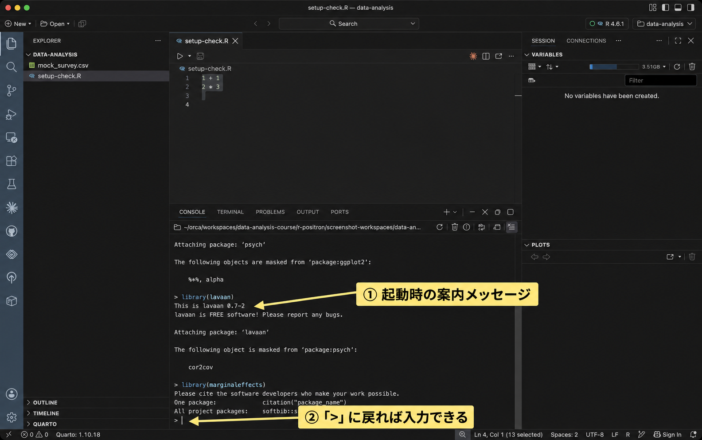{fig-alt="Consoleのパッケージ起動メッセージと、一番下の入力待ちの記号を矢印で示している。" loading="lazy"}

## CSVの読み込み、集計と作図

### CSVの保存

CSVとは、表の値をカンマで区切って保存するファイル形式です。今回使うCSVには、成人1,000人の生活や仕事についての架空の回答が入っています。1行が1人、1列が年齢などの変数に対応します。今回は年齢を表す `age` 列を使います。

[模擬調査データ（mock_survey.csv）をダウンロード](../data/mock_survey.csv){download="mock_survey.csv"}

このリンクからCSVを保存し、先ほど作った `data-analysis` フォルダに移してください。ブラウザに文字列が表示された場合は、リンクを右クリックして「リンク先を保存」などを選びます。ファイル名は `mock_survey.csv` にしてください。末尾に `.txt` や `(1)` が付いていないかも確認しましょう。

PositronのExplorerに、`setup-check.R` と `mock_survey.csv` が並んでいれば、保存先を確認できています。データの変数や回答の選択肢を詳しく知りたい場合は、[模擬調査データの説明](../data/mock-survey.qmd)を参照してください。

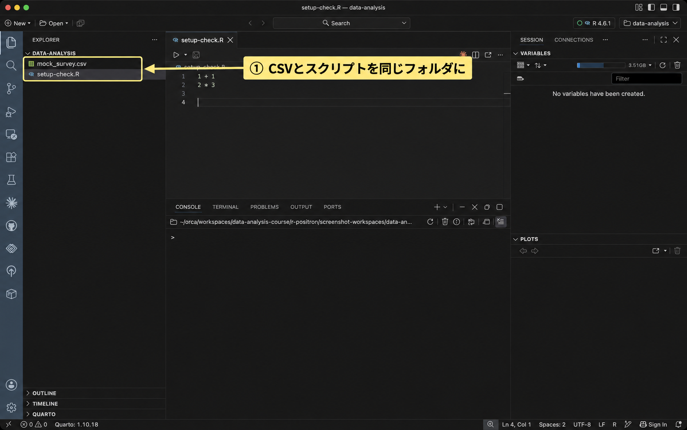{fig-alt="Explorerに並ぶmock_survey.csvとsetup-check.Rを黄色の枠で囲んでいる。" loading="lazy"}

::: {.callout-note collapse="true" title="補足：Rが使うフォルダを確認するには"}

Rがファイルを探す基準の場所を、作業フォルダ（作業ディレクトリ）と呼びます。CSVを読み込めないときなど、Rがどのフォルダを使っているか確かめたい場合は、Consoleで次を実行します。`getwd()` は現在の作業フォルダ、`list.files()` はそこにあるファイル名を表示します。

```{r}
#| label: setup-working-directory
getwd()
list.files()
```

`getwd()` の末尾が `data-analysis` で、`list.files()` に `mock_survey.csv` と `setup-check.R` が出ることを確認します。違う場所が表示されたら、[CSVが見つからない場合](#csv-not-found)の手順で直します。

:::

### CSVの読み込み

ここからのコードは、Editorで `setup-check.R` の末尾に順番に貼り付けます。追加したコードを選択し、WindowsではCtrl+Enter、macOSではCommand+Enterで実行してください。最初の計算2行は残して構いません。

`readr::read_csv()` は、CSVを読み込む関数です。`readr` はtidyverseと一緒に入るパッケージで、`パッケージ名::関数名` と書くと、そのパッケージの関数を指定できます。`"mock_survey.csv"` は、先ほど授業用フォルダに保存したファイルの名前です。

```{r}
#| label: setup-read-csv
# tidyverseに含まれるreadrでCSVを読み込む
survey <- readr::read_csv("mock_survey.csv", show_col_types = FALSE)
```

`<-` は、右側の結果に左側の名前を付ける記号です。この行では、読み込んだデータに `survey` という名前を付けました。Consoleに表全体が出なくても、Variablesに `survey` が追加されていれば読み込めています。`show_col_types = FALSE` は、列の型についての案内を省略する指定です。

続けて、データの大きさを確認します。`dim()` は行数と列数を、この順で表示する関数です。

```{r}
#| label: setup-dimensions
dim(survey)
```

Consoleに `[1] 1000 25` と表示されれば、1,000人分、25列のデータを読み込めています。

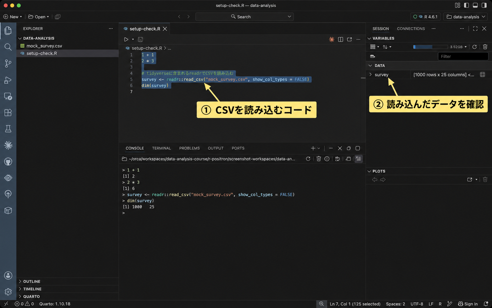{fig-alt="CSVの読み込みコードと、Variablesに追加されたsurveyを矢印で示している。" loading="lazy"}

### 年齢の集計

年齢の分布を数値で確認します。`survey$age` は、`survey` の `age` 列を取り出す書き方です。`summary()` で最小値、四分位数、平均値、最大値などを表示します。

```{r}
#| label: setup-age-summary
summary(survey$age)
```

最小値（Min.）は20、中央値（Median）は49、平均値（Mean）は約49.49、最大値（Max.）は79です。今回のデータは練習用に生成したもので、実際の人口の年齢構成を表しているわけではありません。

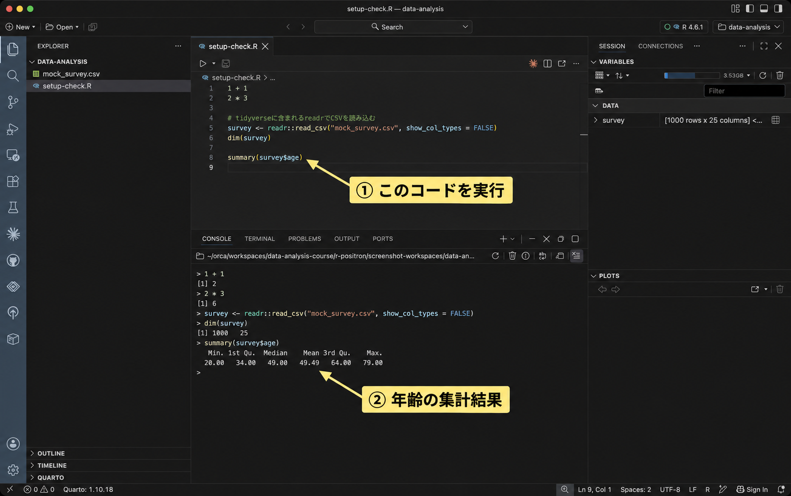{fig-alt="summary(survey$age)の行と、最小値から最大値までの集計結果を矢印で示している。" loading="lazy"}

### 年齢のヒストグラム

ヒストグラムとは、値をいくつかの区間に分け、各区間の人数などを棒の高さで表す図です。ここでは年齢を10歳幅に分けて描きます。下のコード全体を選択して実行してください。

```{r}
#| label: setup-age-plot
# tidyverseに含まれるggplot2で作図する
age_plot <- ggplot2::ggplot(survey, ggplot2::aes(x = age)) +
  ggplot2::geom_histogram(binwidth = 10, boundary = 20,
                         closed = "left", color = "white", fill = "steelblue") +
  ggplot2::labs(x = "Age (years)", y = "Count")
print(age_plot)
```

`ggplot()` で使うデータを指定し、`aes(x = age)` で横軸に年齢を割り当てます。`+` でつなぐ `geom_histogram()` が棒を描き、`labs()` が軸のラベルを付けます。`binwidth = 10` と `boundary = 20` で20歳を境界とする10歳幅にし、`closed = "left"` で20歳以上30歳未満、30歳以上40歳未満、という区間に分けています。

図に `age_plot` という名前を付け、`print(age_plot)` で表示しています。Plotsに6本の棒が出ることを確認しましょう。横軸のAge (years)は年齢、縦軸のCountは人数です。動作確認では英語のラベルを使います。日本語のラベルを使いたい場合は、[日本語ラベルで図を保存する方法](#japanese-labels)を参照してください。

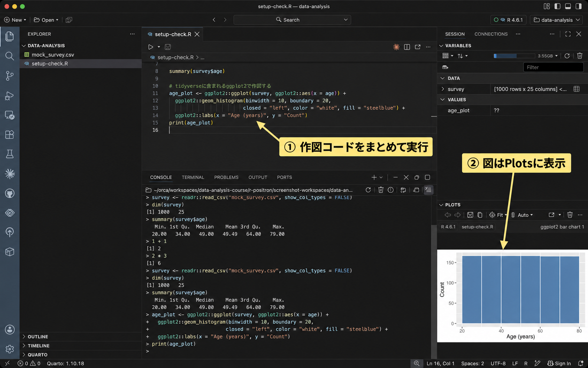{fig-alt="Editorの作図コードと、Plotsに表示された英語ラベルのヒストグラムを示している。" loading="lazy"}

## 保存したスクリプトの再実行

コードを保存しておくと、Rを終了した後も同じ処理をやり直せます。Consoleの実行履歴や、Variablesに残ったデータに頼らず、保存したスクリプトから結果を再現できるか確認しましょう。

1. `setup-check.R` を保存して閉じ、Explorerから開き直します。CSVの読み込み、行数と列数の確認、年齢の集計、作図のコードが残っていることを確かめます。
2. Console上部の円形の矢印にポインタを重ね、「Restart R」と表示されるボタンをクリックしてRを再起動します。Variablesから `survey` と `age_plot` が消え、Consoleに入力待ちの `>` が出るまで待ってください。
3. `setup-check.R` の編集領域をクリックし、WindowsではCtrl+A、macOSではCommand+Aですべてのコードを選択します。そのままCtrl+EnterまたはCommand+Enterで実行します。
4. 行数と列数が `1000 25`、年齢の平均が約49.49となり、Plotsにヒストグラムが出ることを確認します。

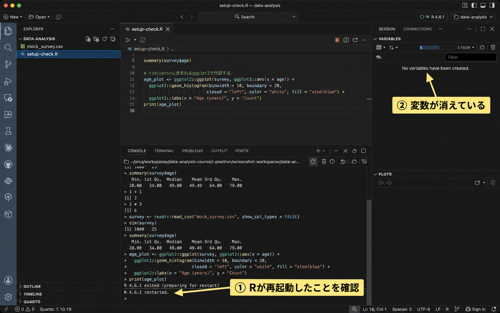{fig-alt="ConsoleのR再起動メッセージと、変数がない状態のVariablesを示している。" loading="lazy"}

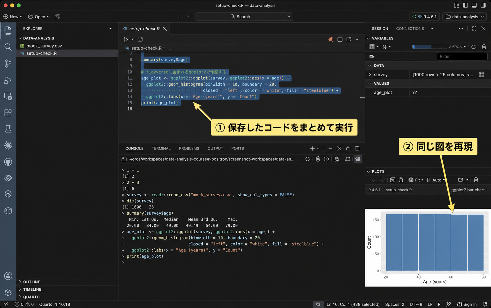{fig-alt="スクリプトの選択範囲と、再実行して表示されたヒストグラムを示している。" loading="lazy"}

これで、保存したスクリプト全体を上から再実行できました。Editor上部の三角ボタン（「Source R File with Echo」）でもファイル全体を実行できますが、この確認では選択範囲の実行と同じ操作で全体を実行しています。`install.packages()` をやり直す必要はありません。今回の分析コードでは `readr::` や `ggplot2::` とパッケージ名を付けているため、`library()` を先に実行しなくても動きます。

## 困ったとき

当てはまる項目を開いて、対処方法を確認してください。

::: {#r-not-found .callout-note collapse="true" title="Rが見つからない・古いRが動く"}

Rのインストール完了後に、Positronを終了して開き直してください。画面右上の選択欄を開き、新しいRを選び直します。Consoleで `R.version.string` を実行すると、実際に使っている版を確認できます。

「Restricted Mode」と表示されている場合は、授業用に自分で作ったフォルダを開いていることを確認し、「Trust this folder」から信頼するフォルダに設定してください。制限モードではRセッションを起動できません。

一覧にRが出ない場合は、Rのインストーラーが完了したか、自分のOSやチップに合うものを選んだかを確認します。解決しない場合は、OS、インストールしたRの版、一覧に何が出るかを教員に伝えてください。

:::

::: {#package-error .callout-note collapse="true" title="パッケージを導入できない"}

「there is no package called …」は、使用中のRでそのパッケージを見つけられないという意味です。Rのバージョンを確認し、エラーに出たパッケージを `install.packages()` で導入してから、`library()` を試してください。

「cannot open URL」やダウンロードの失敗が出たら、インターネット接続を確認します。「non-zero exit status」が出た場合は、その直前にあるエラーも確認してください。最後の1行だけでは、失敗の原因が分からないことがあります。

WindowsのRtoolsやmacOSのコンパイラは、ソースからパッケージを組み立てる際に必要になることがあります。通常のバイナリパッケージの導入では不要です。ソースからのコンパイルを求められた場合は、まずバイナリを使う選択肢があるか確認し、導入できなければエラーを教員に見せてください。

:::

::: {#csv-not-found .callout-note collapse="true" title="CSVが見つからない"}

「does not exist」や「No such file or directory」が出た場合は、`getwd()` でRの作業フォルダ、`list.files()` でファイル名を確認します。ブラウザのダウンロードフォルダにCSVが残っていたら、`setup-check.R` と同じフォルダに移してください。

Positronで開いているフォルダとRの作業フォルダが違う場合は、「File」→「Open Folder…」で授業用フォルダを開き、Rを再起動して確認します。それでも違う場合は、Consoleで次のように作業フォルダを指定できます。引用符の中は、**自分の `data-analysis` フォルダの場所に置き換えてください。** Windowsでも区切りを `/` にすると、Rで扱いやすくなります。

```{r}
#| label: setup-setwd
setwd("C:/Users/自分のユーザー名/Documents/data-analysis")
```

上はWindowsの例です。macOSなら `/Users/自分のユーザー名/Documents/data-analysis` のような場所になります。保存先はパソコンによって異なります。この指定は自分のパソコンだけで使うため、配布用のコードにそのままコピーしないでください。

:::

::: {.callout-note collapse="true" title="コードが途中で止まる"}

「object 'survey' not found」は、`survey` がまだ作られていないという意味です。CSVの読み込みから順に実行し直し、途中でエラーが出ていないか確認しましょう。図のコードは、最後の `print(age_plot)` までまとめて選択します。

Consoleの入力待ちが `>` ではなく `+` のままになったら、括弧や引用符が閉じておらず、Rが続きを待っている可能性があります。ConsoleでEscを押して入力を取り消し、スクリプトのコードを教材と見比べてから、まとまり全体を実行し直してください。

:::

::: {#japanese-labels .callout-note collapse="true" title="日本語ラベルで図を保存する"}

図の日本語が四角になったり消えたりする場合は、日本語に対応したフォントと、図を描く方法を確認します。このページの動作確認は英語ラベルで完了して構いません。

PNG画像として保存する方法を紹介します。`ragg` は、図を画像ファイルに描くパッケージです。必要な場合はConsoleで一度だけ導入してください。

```{r}
#| label: setup-install-ragg
# 日本語フォントを使ってPNG画像を保存するために導入する
install.packages("ragg", repos = "https://cloud.r-project.org")
```

次の例では、macOSの `Hiragino Sans` を指定しています。Windowsでは、インストール済みの `Yu Gothic` など、日本語を含むフォント名に置き換えてください。`age_plot` を作った後に、次のまとまり全体を実行します。

```{r}
#| label: setup-japanese-png
age_plot_ja <- age_plot +
  ggplot2::labs(x = "年齢（歳）", y = "人数") +
  ggplot2::theme(text = ggplot2::element_text(family = "Hiragino Sans"))
ragg::agg_png("age-japanese.png", width = 1200, height = 800, res = 160)
print(age_plot_ja)
dev.off()
```

`agg_png()` で描画先のファイルを開き、`print()` で描き、`dev.off()` で保存を終えます。同名の `age-japanese.png` がある場合は上書きされるので、残したい画像があればコードの保存名を変えてください。Explorerから保存された画像を開き、日本語を読めるか確認します。

この方法はPNGへの出力です。`ragg` をインストールするだけでは、PositronのPlotsの描画方法やフォント設定が切り替わるわけではありません。保存画像でも文字が出ない場合は、指定したフォントが入っているかを確認してください。[raggの公式説明](https://ragg.r-lib.org/)も参照できます。

:::

::: {.callout-note collapse="true" title="AIに質問する場合（任意）"}

ブラウザのAIを、エラーの原因を調べる補助に使っても構いません。OS、Rの版、試した操作、エラー文を伝えると、状況を説明しやすくなります。次の枠の角括弧の部分を、自分の状況に置き換えてください。

```{.default .prompt}
PositronでRを使っています。
OS: [Windows 11 / macOSのバージョンなど]
Rのバージョン: [R.version.stringで確認した版]
目的: 授業用フォルダに保存したmock_survey.csvを読み込みたいです。
試したコード: readr::read_csv("mock_survey.csv", show_col_types = FALSE)
エラー文: [ここに貼り付ける]
原因を確認する手順を、一つずつ説明してください。
```

CSV本体や回答データは送信しません。エラー文やファイルの場所にユーザー名などの個人情報が含まれる場合は、伏せてから貼り付けてください。変数の説明が必要な場合も、変数名、型、値の範囲に留めます。AIの返答は、このページの手順と照らし合わせて確認します。解決しない場合や説明が分からない場合は、教員に質問してください。AIの利用は、このページの完了条件には含みません。

:::

## 参考資料

インストールと操作の詳細は、以下の公式資料を参照してください。配布版と対応OSは2026年9月22日に確認しました。

- [R for Windows](https://cran.r-project.org/bin/windows/base/)
- [R for macOS](https://cran.r-project.org/bin/macosx/)
- [Positronの導入](https://positron.posit.co/download.html)
- [Positronで使うRの選択と再起動](https://positron.posit.co/managing-interpreters.html)
- [Positronのキーボード操作](https://positron.posit.co/keyboard-shortcuts.html)
